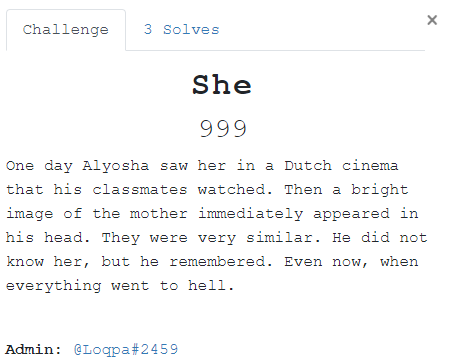
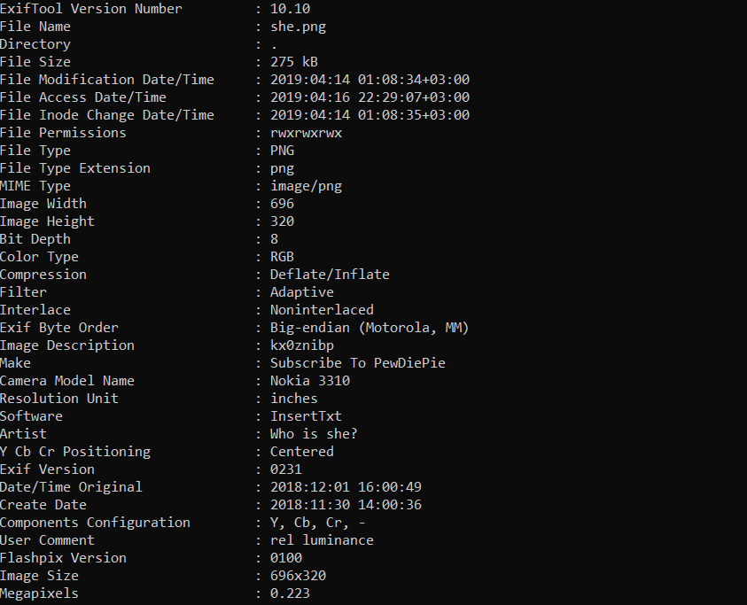
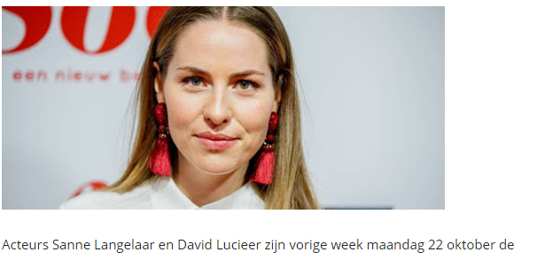
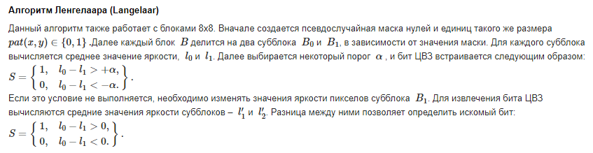

# She


Идейным вдохновителем таска можно считать книгу "Цифровая стеганография" или как я узнал - 1000 и 1 алгоритм стеганографии, которыми никто не пользуется.

	*странное описание таска, к которому я почти не имею отношения*
	
Начинать решение заданий со стегой я предпочитаю с `exiftool`. В данном случае (не считая парочки мемов) в нем хранились все хинты, но на первом этапе их смысл не ясен. 



В метаданных мы встречаем вопрос `Who is she?`, который как и название этого таска намекает нам на то, что женщина на картинке тут неспроста.

Загружаем картинку в google и выясням, что женщину зовут **Sanne Langelaar**.



Задаемся вопросоом - как она связана со стеганографией? Следующий запрос формата `лангелаар стеганография` дает ответ на этот вопрос.



Изучив описание алгоритма понимаем, что нам нужна маска. Также при его изучении я для себя не выяснил каким именно образом должна оценивается яркость, но оставим это на совести авторов алгоритма. <br />
Ответы на оба этих вопроса в рамках таска хранят метаданные.

	Image Description               : kx0znibp
	Software                        : InsertTxt

Опытные ctf-ры втретив строчку из 8 символов срауз идут проверять pastebin, для менее опытных была оставлена подсказка insertTxt(простите).

По ссылке https://pastebin.com/kx0znibp находим скрипт:
```python
#!/usr/bin/python3

import random

def generateMatrix():    
    password = "I$_Th1$_Th3_R3@L_P@$$w0Rd?!?"
    random.seed(password)
    
    matrix = [[0 for y in range(8)] for x in range(8)]

    for i in range(8):
        for j in range(8):
            matrix[i][j] = random.randint(0,1)
    return matrix
```
На этом вопрос с маской закрыт. А что там насчет яркости? И снова метаданные приходят к нам на помощь
	`User Comment                    : rel luminance`

В очередной раз воспользуемcя поиском google и найдем формулу:
	`Relative Luminance Y=0.2126R+0.7152G+0.0722B`
	
На этом этапе у нас есть все что нужно, чтобы извлечь сообщение. <br />
*У некоторых участников возникли вопросы о целостности контейнера, т.к. на просторах github есть реализация этого алгоритма на js для .bmp файлов, которая не очень работает.*
 
Код декодера:
```python
import cv2
import numpy as np
from generateMask import *


mask = generateMatrix()

def getBit(block, mask):
    av_1 = 0
    av_0 = 0
    for i in range(8):
        for j in range(8):
            if mask[i][j] == 1:
                av_1 += getBrightness(block[i][j])
            else:
                av_0 += getBrightness(block[i][j])

    oneEntries = np.count_nonzero(mask)

    av_1 = av_1 / oneEntries
    av_0 = av_0 / (64 - oneEntries)

    if (av_0 - av_1 >= 0):
        return '1'
    elif (av_0 - av_1 < 0):
        return '0'

def getBrightness(pixel):
    #cv2 по умолчанию парсит картинки в формат GBR
    return 0.2126*pixel[2]+0.7152*pixel[1]+0.0722*pixel[0]

image = cv2.imread('she.png')

data = ""

block_img = np.zeros(image.shape)
im_h, im_w = image.shape[:2]
print(im_h, im_w)
bl_h, bl_w = 8, 8

for row in np.arange(im_h - bl_h + 1, step=bl_h):
    for col in np.arange(im_w - bl_w + 1, step=bl_w):
        data += getBit(image[row:row+bl_h, col:col+bl_w], mask)

print(data)       
```

**Переведя бинарные данные в строку получим флаг:** `YauzaCTF{D1g1t@L_w@T3rM@rK1Ng_w1tH_L@nG3L@@r}`        


